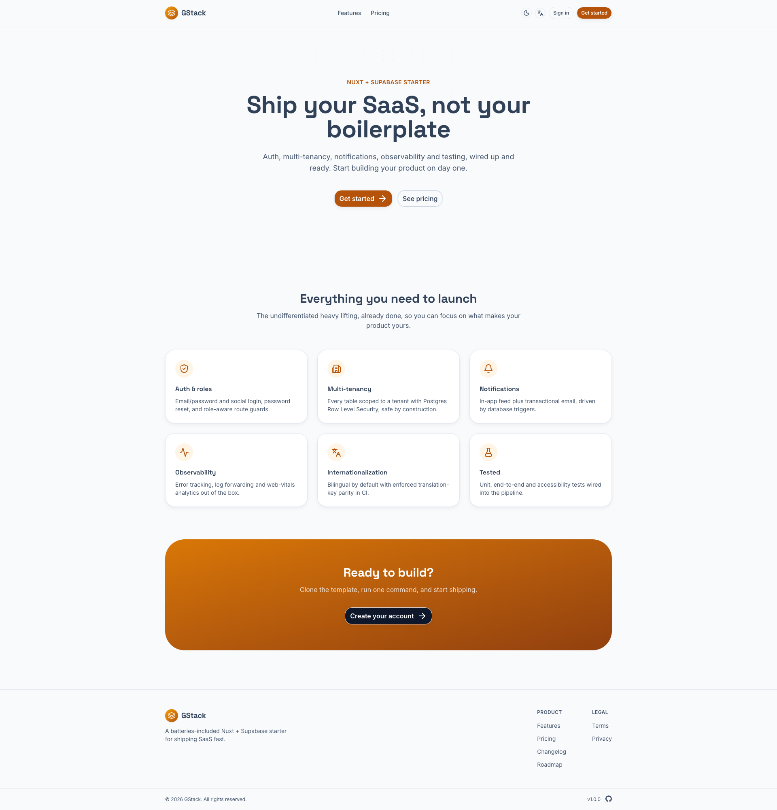
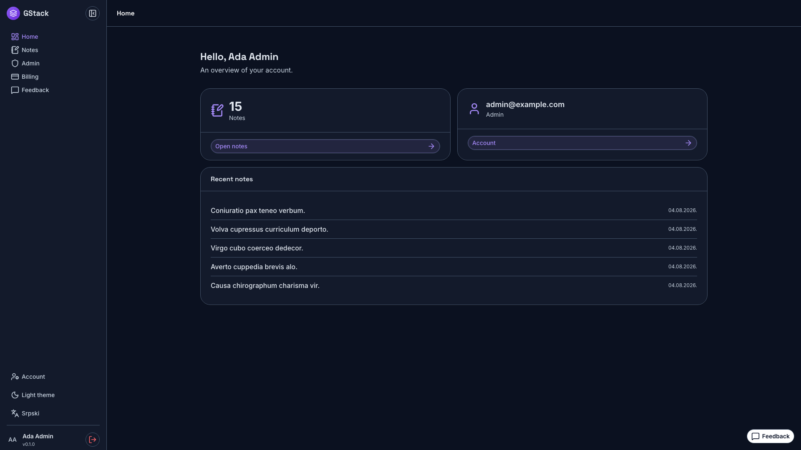
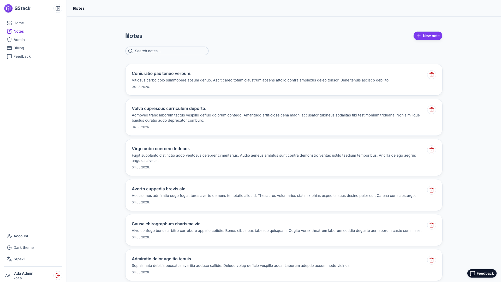
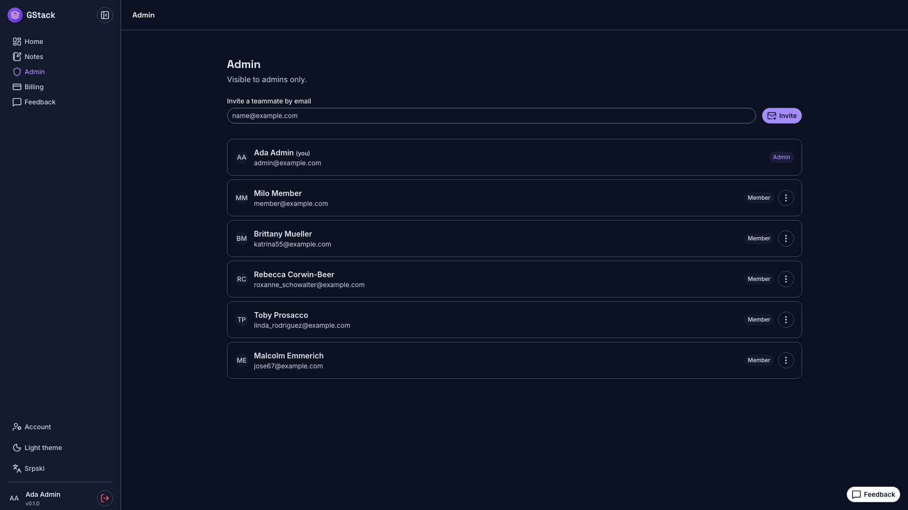

# GStack

A batteries-included starting point for a multi-tenant, role-aware SSR app:
Nuxt 4, Supabase (Postgres + Auth), Nuxt UI v4, i18n (English + Serbian), plus
observability, notifications, seeding, and release tooling wired up. One example
CRUD (`notes`) shows the pattern to copy for your own domain.

> **Using this as a template?** Click **"Use this template"** on GitHub, then
> follow [`SETUP.md`](SETUP.md) — one rename command and env setup and it's yours.

|                                                |                                                  |
| ---------------------------------------------- | ------------------------------------------------ |
|  |  |
|      |          |

<sub>Regenerate with `pnpm screenshots` — every route, both themes, plus a mobile pass.</sub>

## What's included

- **Auth** — email/password + social login (GitHub, Google via Supabase OAuth),
  registration, password reset, email confirmation. Global role-aware middleware
  (`app/middleware/auth.global.ts`), not the module redirect.
- **Multi-tenancy** — every table is tenant-scoped by RLS via a `current_tenant_id()`
  helper. Self-service registration creates a tenant with the registrant as admin.
- **Roles** — `member` / `admin`, enforced by RLS (the real gate) + page meta (UX).
- **Example CRUD** — `notes`, RLS-scoped. `layers/notes/app/composables/useNotes.ts` + `layers/notes/app/pages/notes/*`.
- **Notifications** — in-app feed + bell + transactional email (Resend). A DB trigger
  fans a new note out to tenant admins; a DB webhook mirrors it to email. Off by
  default — flip `NUXT_PUBLIC_NOTIFICATIONS_ENABLED=true`.
- **Billing** — Polar checkout + customer portal + webhook, plan gating via
  `useSubscription()` (`layers/billing`). Off until keys are set.
- **Account & admin** — self-serve account deletion; admin user list with
  invite / set-role / ban / delete / impersonate (`layers/{account,admin}`).
- **Transactional email** — Resend + a typed template layer with a dev preview
  route at `/dev/emails` (`layers/email`).
- **Feedback** — self-hosted in-app widget, RLS-scoped, no third-party script
  (`layers/feedback`). Off by default.
- **Onboarding tour** — driver.js first-run product tour targeting nav by `href`
  (`layers/tour`). Off by default.
- **Analytics & flags** — PostHog pageviews + `useFeatureFlag()` that degrades to
  a fallback when PostHog is off (`layers/analytics`). Off by default.
- **Observability** — Sentry (client + server + 5xx forwarding + tunnel), BetterStack
  log forwarding, Vercel Analytics + Speed Insights. All no-op until configured.
- **Seeding** — `pnpm seed` builds a demo tenant (admin + members + notes) with
  `@faker-js/faker`. Idempotent; wipes the `@example.com` demo domain first.
- **i18n** — `en` (default) + `sr`, parity-checked in CI.
- **Testing** — vitest (pure logic, **100% coverage gate** on the logic layer) +
  Playwright (e2e + a11y via axe, both themes). Includes a **tenant-isolation e2e**
  that proves one tenant can never read another's rows through RLS.
- **DX** — `pnpm setup` (pick your integrations, it writes `.env`), `pnpm doctor`
  (verifies them — both driven by one manifest), `pnpm gen:layer <name>` to scaffold
  a feature, and Claude Code skills checked into `.claude/skills/`.
- **CI/release** — GitHub Actions (lint/test/typecheck, scheduled a11y, PR visual
  regression) + release-please + a user-facing `/changelog`.

## Direction

📖 **[Documentation → terrorsquad.github.io/gstack](https://terrorsquad.github.io/gstack)**
— getting started, architecture, and the reasoning. Source in [`site/`](site/).

This is the **GStack**. What it is and why: [`docs/gstack.md`](docs/gstack.md).
What's built and what's next: [`docs/roadmap.md`](docs/roadmap.md). Key decisions
(payments, data layer, Redis, distribution): [`docs/adr/`](docs/adr/).

## Setup

Get the code — it's a GitHub **template repository**, so make your own repo from
it rather than forking:

```bash
# GitHub CLI: creates your repo from the template and clones it
gh repo create my-app --template TerrorSquad/gstack --private --clone && cd my-app

# or, no GitHub account needed (downloads the files, no git history)
pnpm dlx degit TerrorSquad/gstack my-app && cd my-app && git init
```

Then:

```bash
pnpm install
cp .env.example .env          # fill in after `pnpm supabase start`
pnpm setup                    # pick which integrations to enable + stub their env vars
pnpm supabase start           # local Postgres + Auth (needs Docker)
pnpm db:reset                 # apply the migration + seed
pnpm db:types                 # regenerate the typed client from the live schema
pnpm dev                      # http://localhost:3000
```

Demo logins after `pnpm db:reset`: `admin@example.com` / `member@example.com`,
password `Demo123!Demo123`.

The typed client (`shared/types/database.types.ts`) ships hand-written so `pnpm dev`
and typecheck work before Supabase is up. Run `pnpm db:types` to regenerate it.

## Commands

```bash
pnpm dev / build / preview
pnpm test              # vitest unit tests
pnpm test:e2e          # Playwright e2e + a11y (needs seeded local Supabase)
pnpm lint / fmt
pnpm lint:i18n / lint:i18n-keys
pnpm db:reset          # reset local DB + migrate + seed
pnpm db:types          # regenerate shared/types/database.types.ts
pnpm seed              # reseed (SEED_FAST=1 for the minimal set)
```

## Making yourself an admin

Registration makes you your tenant's admin automatically. To promote a member:

```sql
update public.profiles set role = 'admin' where email = 'you@example.com';
```

## Configuring the extras

- **Notifications email**: set `NUXT_PUBLIC_NOTIFICATIONS_ENABLED=true`, `NUXT_RESEND_KEY`,
  and `NUXT_NOTIFICATION_WEBHOOK_SECRET`, then add a Supabase DB webhook on
  `notifications` INSERT → POST `/api/hooks/notification-email` with the secret header.
- **Social login**: enable `[auth.external.github]` / `[auth.external.google]` in
  `supabase/config.toml`, set the client id/secret env vars (see `.env.example`),
  and restart local Supabase. The login-page buttons are already wired.
- **Sentry**: set `NUXT_PUBLIC_SENTRY_DSN` (+ org/project in `nuxt.config.ts`).

## Notes

- Branding is generic ("GStack", indigo theme). `node scripts/rename.mjs "My App"`
  swaps the display name everywhere; brand palette (`layers/ui/app/assets/css/main.css`),
  favicon and LICENSE are by hand — see [`SETUP.md`](SETUP.md).
- Auth email templates (`supabase/templates/*.html`) are **generated** from the same
  shell as the app's own mail — edit `scripts/gen-auth-templates.ts`, not the HTML,
  then `pnpm gen:auth-templates`. A unit test fails if the committed files drift.
- `CHANGELOG.md` is release-please's (never hand-edit). The user-facing changelog
  is `app/utils/changelog.ts` → `/changelog`; see the `changelog` skill.
